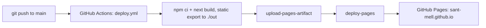

# Santiago Aguilar Mello, Portfolio (`sant-mell.github.io`)

Personal portfolio site built with Next.js 16 (App Router), React 19, TypeScript, and Tailwind CSS v4. It is a central hub for my resume, academic background at Tec de Monterrey, and hands-on projects in embedded/IoT, full-stack, and parallel computing.

Live site: https://sant-mell.github.io  ·  CV: [`/cv.pdf`](public/cv.pdf)  ·  Email: sant.mell016@gmail.com

## About

- Native Portuguese and Spanish, English C2, Dutch A1. Sao Paulo roots, IB Diploma in Rotterdam, Computer Science in Mexico City.
- Computer Science and Technology (ITC) student at Tec de Monterrey, Campus Santa Fe.
- Open to work, including remote and global roles. Demonstrated strengths in embedded/IoT, full-stack, and parallel computing. Targeting the Cisco CCNA and cybersecurity as next steps.

## Tech Stack

| Layer | Technology |
| --- | --- |
| Framework | Next.js 16 (App Router), React 19 |
| Language | TypeScript 5 |
| Styling | Tailwind CSS v4, grayscale/monochrome theme with glassy translucent cards |
| Animation | Framer Motion, scroll reveals, animated gradients |
| 3D / Shaders | three.js and @react-three/fiber (interactive globe), @paper-design/shaders-react (animated background) |
| i18n | English, Spanish, Portuguese, and Dutch language switcher |
| Deployment | GitHub Pages (static export) |

## Sections

1. Hero, an animated profile card with an "Open to Work" tag, LinkedIn and email actions, and a CV download.
2. Where I'm from, an interactive three.js globe marking Sao Paulo, Rotterdam, and Mexico City, plus language proficiency.
3. On GitHub, a live GitHub contribution chart with a hover link preview.
4. Projects, a project grid with live demos, impact figures, a benchmark chart, an architecture diagram, and links to each public repository.
5. My path so far, an interactive radial orbital timeline over an animated grayscale shader background.
6. Experience, teaching and mentoring roles across Mexico and the Netherlands.
7. Academics, GPA and other metrics.
8. Skills, grouped into Systems and Dev, Tools and IoT, and Languages.
9. Certifications and awards.

## Projects

| Project | Tech | Repo / link |
| --- | --- | --- |
| IoT Smart Parking System | ESP32, C++, MQTT, ThingSpeak, Python | [`smart-parking-iot`](https://github.com/sant-mell/smart-parking-iot) |
| DT Construct ICS (freelance) | Vanilla HTML/CSS/JS, Leaflet | [`dt-website`](https://github.com/sant-mell/dt-website) · [dtc-ingenieria.com](https://dtc-ingenieria.com) |
| Parallel DFA Syntax Highlighter | Python, automata theory, multiprocessing | [`parallel-syntax-highlighter`](https://github.com/sant-mell/parallel-syntax-highlighter) |
| The Fool's Descent (TC2005B) | JavaScript, HTML5 Canvas, Node/Express, MySQL | [`videoGame-TC2005B.501`](https://github.com/sant-mell/videoGame-TC2005B.501) |
| Breakout (TC2005B) | JavaScript, HTML5 Canvas, custom engine | [`myTC2005B`](https://github.com/sant-mell/myTC2005B) · [play in browser](https://sant-mell.github.io/myTC2005B/Videojuegos/Breakout/breakout.html) |
| Aquaroute (START Hack) | SaaS, weighted Dijkstra, satellite data | [LinkedIn writeup](https://www.linkedin.com/in/santiago-aguilar-b1702a270/) |
| Next.js Portfolio | Next.js 16, React 19, Tailwind 4 | This site. |

## Experience

- English Language Teacher, Pro English BV, Rotterdam (Jul 2025 to present).
- Computer Science Instructor, Logaritmia MX (Jan 2025 to May 2025).
- Volunteer and Peer Mentor, Tec de Monterrey (2024 to present).
- Media Logistics Assistant, DPG Media Nederland (Jun 2022 to Aug 2022).

## Local Development

```bash
npm install
npm run dev      # http://localhost:3000
npm run build    # static export to ./out
```

## Deployment

The site builds to a static export (`output: "export"` in `next.config.ts`, `images.unoptimized: true`) and is served only from GitHub Pages at https://sant-mell.github.io.



`public/.nojekyll` keeps the `_next/` directory intact. In repo settings, Pages source is set to GitHub Actions.

## Contact

- Email: sant.mell016@gmail.com
- GitHub: [github.com/sant-mell](https://github.com/sant-mell)
- LinkedIn: [santiago-aguilar](https://www.linkedin.com/in/santiago-aguilar-b1702a270/)
